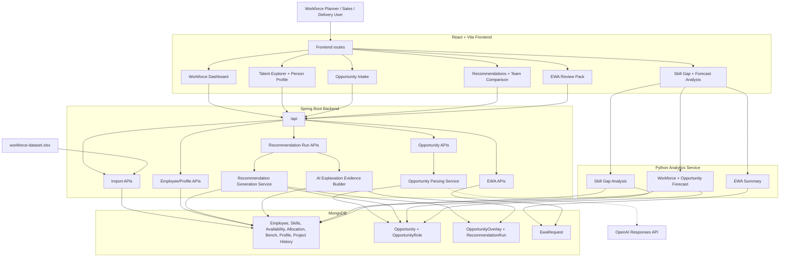

# AI Workforce Planner

AI Workforce Planner is an AI-assisted workforce planning application built for the InSync Hackathon.

The application helps workforce planners, sales leaders, and delivery leaders explore available talent, create staffing opportunities, generate evidence-backed team recommendations, compare staffing options, and prepare final recommendations for EWA review.

The goal is not to replace human judgement. The goal is to bring together workforce data, opportunity requirements, availability, skills, project history, and recommendation reasoning so staffing decisions can be made faster and with more confidence.

For local setup with Rancher Desktop and Docker Compose, see [SETUP.md](SETUP.md).

---

## Table of Contents

- [Tech Stack](#tech-stack)
- [Project Structure](#project-structure)
- [Architecture Flow](#architecture-flow)
- [Environment Variables](#environment-variables)
- [Docker Compose](#docker-compose)
- [Core Features](#core-features)
- [Dataset Usage](#dataset-usage)
- [API Endpoints](#api-endpoints)
- [Main Development Priority](#main-development-priority)
- [Development Notes](#development-notes)

---

## Tech Stack

### Frontend

- React
- TypeScript
- Vite
- React Router
- Zod for form validation
- Axios to fetch API for backend requests
- Component-level CSS for page and feature styling

### Backend

- Spring Boot
- Java
- Jakarta Bean Validation with `@Valid`
- Lombok DTO/entity helpers
- Jackson `ObjectMapper` for OpenAI JSON parsing
- RESTful API architecture
- OpenAI Responses API for opportunity requirement parsing, with a local fallback parser when OpenAI is unavailable

### Analytics

- Python analytics service
- MongoDB-driven insight APIs

The Python analytics service reads cleaned data from MongoDB and returns summarized analysis results for frontend visualization. 

### Database

- MongoDB

MongoDB stores workforce data, opportunity data, generated recommendations, validation data, analysis outputs, and EWA-related records.

---

## Project Structure

```txt
AI-Workforce-Planner/
  README.md

  frontend/
    src/
      api/
      components/
        common/
        layout/
        talent/
        profile/
        opportunity/
        recommendation/
        ewa/
        analysis/
        opportunity/
      constants/
      hooks/
      pages/
      routes/
      types/
      utils/
      validation/

  backend/
    src/
      main/
        java/
          com/
            example/
              backend/
                config/
                controller/
                dto/
                entity/
                repository/
                service/
        resources/
```

---

## Architecture Flow

The application is split into a React frontend, a Spring Boot backend, a Python analytics service, MongoDB, and optional OpenAI-assisted parsing/explanation.



Main data flow:

1. Workforce Excel data is imported into MongoDB.
2. Users search workforce data from Talent Explorer and Dashboard.
3. Opportunity Intake parses role requirements, then saves `Opportunity` and `OpportunityRole`.
4. Recommendation generation reads the saved opportunity, roles, and workforce scoring inputs, generates `OpportunityOverlay`, builds three team options, and saves a `RecommendationRun`.
5. Recommendation pages read the latest saved run, compare options, and prepare selected candidates for EWA.
6. Python analytics reads MongoDB directly for skill gap, forecast, and EWA summary insights.

---

## Environment Variables

### Frontend

| Variable | Default | Purpose |
| --- | --- | --- |
| `VITE_API_BASE_URL` | `http://localhost:8080` | Spring Boot backend origin used by employee, import, opportunity, ewa, and recommendation APIs. Frontend calls paths such as `/api/opportunities/parse`. |
| `VITE_ANALYTICS_API_BASE` | `/python-analysis` | Python analytics API base path through the Vite proxy. |
| `VITE_BACKEND_PROXY_TARGET` | `http://127.0.0.1:8080` | Vite dev-server proxy target for `/api`. |
| `VITE_ANALYTICS_PROXY_TARGET` | `http://127.0.0.1:8000` | Vite dev-server proxy target for `/python-analysis`. |

### Backend

These are configured in `backend/src/main/resources/application.properties` and can be overridden with environment variables.

| Property / Variable | Default | Purpose |
| --- | --- | --- |
| `spring.mongodb.uri` / `SPRING_MONGODB_URI` | `mongodb://localhost:27017/ai-workforce-planner` | MongoDB database connection. |
| `app.import.employee-dataset` | `classpath:data/workforce-dataset.xlsx` | Default Excel dataset location. |
| `app.import.employee-dataset-on-startup` | `true` | Dataset startup import flag. |
| `app.cors.allowed-origins` | `http://localhost:5173` | Allowed frontend origin for backend API calls. |
| `openai.api-key` / `OPENAI_API_KEY` | empty; configure locally in `.env` | OpenAI API key for opportunity parsing and recommendation explanations. Do not commit real keys. |
| `openai.model` / `OPENAI_MODEL` | `gpt-5.4-mini` | OpenAI model used by opportunity parsing and recommendation explanations. |

Note: Dataset import is explicit. Employee GET APIs do not auto-import data.

### Python Analytics

| Variable | Default | Purpose |
| --- | --- | --- |
| `MONGODB_URI` | `mongodb://localhost:27017` | MongoDB server URI |
| `MONGODB_DATABASE` | `ai-workforce-planner` | MongoDB database name |

---

## Docker Compose

Docker Compose can start MongoDB, Spring Boot, Python analytics, and the React frontend together.

```powershell
docker compose up --build
```

Service ports:

| Service | URL |
| --- | --- |
| Frontend | `http://localhost:5173` |
| Spring Boot backend | `http://localhost:8080` |
| Python analytics | `http://127.0.0.1:8000` |
| MongoDB | `mongodb://localhost:27017` |

After the containers are running, import a dataset from the Dashboard by choosing the Excel file. The frontend uploads it to:

```txt
POST http://localhost:8080/api/import/workforce-dataset/upload
```

You can also import the default backend resource directly:

```txt
POST http://localhost:8080/api/import/workforce-dataset
```

Docker-specific connection values are already configured in `docker-compose.yml`:

- Backend uses `mongodb://mongodb:27017/ai-workforce-planner`
- Python analytics uses `mongodb://mongodb:27017`
- Frontend proxies `/api` to `http://backend:8080`
- Frontend proxies `/python-analysis` to `http://python-analytics:8000`

---

## Core Features

### 1. Workforce Dashboard

Shows a high-level workforce overview.

Planned information:

- Total employees
- Bench count
- Allocated count
- Upcoming availability
- Available people across 30, 60, and 90 days
- Availability by role, skill, grade, location, and region

The **New Opportunity** button navigates to the Opportunity Intake page.

---

### 2. Talent Explorer

Allows users to search and filter employees.

Main functions:

- Search employees
- Filter by skill, role, grade, location, domain, availability, and allocation status
- Display employee fit percentage based on filter results
- Click an employee row to view the Person Profile

When opened from Talent Explorer, the Person Profile shows only basic employee details.

---

### 3. Person Profile

The Person Profile has two display modes.

#### Basic Profile Mode

Opened from Talent Explorer.

Shows:

- Employee details
- Role
- Grade
- Location
- Skills
- Availability
- Current allocation
- Project history
- Domain experience

---

### 4. Opportunity Intake

Allows users to create a staffing opportunity using natural language and structured fields.

The current intake flow is:

1. User fills required business fields and writes an opportunity statement.
2. User clicks **Parse requirements**.
3. Frontend validates required fields with Zod before calling the backend.
4. Backend parses or infers opportunity roles and role requirements using OpenAI when available. A local fallback parser provides basic extraction for roles, known skills, grade preferences, FTE, split-candidate wording, domain, location preference, and selected flexibility notes.
5. User reviews the validated preview and role cards.
6. User clicks **Generate options**.
7. The opportunity and opportunity roles are saved to MongoDB, then the app navigates to the Recommendation page.

The opportunity is **not saved** during parsing. It is saved only after the user confirms **Generate options**.

Required intake fields:

- Opportunity statement
- Opportunity brief
- Opportunity name
- Client name
- Domain
- Country
- Expected start date
- Duration weeks
- Probability
- Commercial priority

Optional intake fields:

- Client type
- Region
- City
- Timezone preference

Current parsing and validation behavior:

- Form fields are authoritative when they conflict with statement text.
- Opportunity IDs and Opportunity role IDs are generated from the latest MongoDB opportunity/ opportunity role number, such as `OPP-005`, `OPR-0061`.
- Role generation is blocked when role name, grade preference, required skills, or desired skills are incomplete.
- Delivery risk is inferred by OpenAI when available and defaults to `Medium` when missing.
- Role priority is normalized to `High`, `Medium`, or `Low`, falling back to commercial priority and then `Medium`.

---

### 5. Recommendation Engine

Generates evidence-backed staffing options for a saved opportunity.

The engine is rule-based and auditable. AI may later generate explanation text, but the matching score itself is calculated in backend code.

Current generation flow:

1. Fetch the saved `Opportunity` and related `OpportunityRole` records.
2. Load scoring inputs from MongoDB: `Employee`, `EmployeeSkill`, `Availability`, `Profile`, and `ProjectHistory`.
3. Score every employee against every opportunity role.
4. For each role, select up to 3 generated `OpportunityOverlay` candidates.
5. Build 3 team options from the generated overlays.
6. Save the full result to `RecommendationRun` with `explanationStatus = PENDING_AI_INTEGRATION`.
7. The latest saved run can be fetched by opportunity ID and can later be updated with AI explanation status/content.

Generated options:

1. **Best Skill Fit**
   - Sorts role candidates by capability fit first, then overall staffing score, then availability.

2. **Fastest Available Team**
   - Sorts role candidates by availability fit first, then earliest full availability date, then overall staffing score.

3. **Balanced Low-Risk Team**
   - Sorts role candidates using a balanced score:

```txt
Balanced sort score =
overallStaffingScore * 70%
+ availabilityFitScore * 20%
- memberRiskScore * 10%
```

Team construction rules:

- If a role cannot combine candidates, the option selects the top sorted candidate for that role.
- If a role can combine candidates, the option adds sorted candidates until required FTE is covered, while respecting minimum individual FTE.
- The same employee is not reused across multiple roles inside the same option.
- If two generated options have the same team, the engine tries to swap one role with an acceptable alternative. The alternative must have availability score at least 70, capability within 15 points, option score within 15 points, and risk increase no more than 20 points.

Candidate scoring uses these main formulas:

```txt
requiredCoverage = matched required skills / total required skills * 100
desiredCoverage  = matched desired skills / total desired skills * 100

skillLevelScore  = average matched skill level / 5 * 100
experienceScore  = average matched years experience / 8 * 100

skillStrength =
skillLevelScore * 65%
+ experienceScore * 35%
```

`5` is the maximum skill level in the dataset. `8` is used as the experience cap for scoring so very senior experience does not over-dominate the match.

```txt
capabilityRawScore =
30
+ requiredCoverageRatio * 35
+ desiredCoverageRatio * 15
+ skillStrength * 5%
+ gradeScore * 10%
+ domainScore * 5%
+ locationScore * 5%
+ projectRelevanceScore * 5%

capabilityFitScore = min(capabilityRawScore, 100)

overallStaffingScore =
capabilityFitScore * 70%
+ availabilityFitScore * 30%
```

The capability score is clamped to `0-100`.

Availability scoring:

```txt
availabilityFitScore =
available FTE at role start / required role FTE * 100
```

The score is capped at `100`. FTE gap is calculated as:

```txt
fteGap = required role FTE - available FTE at start
```

Grade scoring:

```txt
Exact grade match       = 100
1 level difference      = 80
2 level difference      = 65
Larger level difference = 50
Unknown grade data      = 70
Text mismatch fallback  = 60
```

Location scoring:

```txt
City match                  = 100
Country match               = 85
Region match                = 70
Remote acceptable + remote  = 65
Remote employee fallback    = 55
No location match           = 40
No target location supplied = 75
```

Domain and project scoring:

- Domain score compares the opportunity/role target domain against employee primary domain, secondary domain, profile domain summary, and project history domains.
- Project relevance starts at `35`, adds `18` for each project domain hit, `6` for each project technology/method hit, and `2` for each direct employee skill hit. It is capped at `100`.

Team-level skill coverage:

```txt
teamSkillCoverageScore =
required skill coverage * 70%
+ desired skill coverage * 30%
```

If a role has only required or only desired skills, the available category receives the full effective weight. The recommendation run stores both team-level and member-level:

- `matchedRequiredSkills`
- `missingRequiredSkills`
- `matchedDesiredSkills`
- `missingDesiredSkills`
- `skillCoverageScore`

Team-level location fit:

```txt
locationFitScore = average member locationScore
locationFit      = unique selected member countries
```

Risk scoring:

```txt
availabilityRisk = average(fteGap / (available FTE at start + fteGap) * 100)
readinessRisk    = readinessDays / 90 * 100, capped at 100
confidenceRisk   = 100 - confidenceScore
constraintRisk   = members with blocking constraints / selected members * 100

riskScore =
availabilityRisk * 50%
+ readinessRisk * 25%
+ confidenceRisk * 15%
+ constraintRisk * 10%
```

Risk level:

```txt
0-30   LOW
31-75  MEDIUM
76-100 HIGH
```

Saved recommendation run data includes:

- Recommendation run ID, opportunity ID/name, generated timestamp, overlay count, and explanation status
- Three options with confidence score, risk score, risk level, readiness days, selected member count, team skill coverage, team location fit, matched/missing team skills, risks, and members
- Each member with role, employee, rank, fit status, capability score, availability score, overall score, skill coverage, matched/missing skills, FTE at start, FTE gap, earliest full availability date, rationale, and constraint

---

### 6. Team Comparison

Compares generated staffing options side by side.

Comparison areas:

- Skill coverage
- Availability readiness
- Location fit
- Grade fit
- Risks
- Confidence score
- Missing capabilities


---

### 7. Skill Gap and Workforce Forecast Analysis

Shows workforce insights based on data.

Skill gap analysis includes:

- Required skill coverage
- Priority skill gap
- Average fit percentage
- Employees evaluated after filters
- Ready candidates who match all required skills
- Grouped insight by region, country, city, role, grade, discipline, domain, availability category, or work mode

Workforce forecast includes:

- Available people across 30, 60, and 90 days
- Available FTE across 30, 60, and 90 days
- Forecast grouped by workforce dimensions such as region, role, grade, location, and domain

Opportunity forecast includes:

- Total required FTE from open opportunities
- Probability-weighted forecast FTE
- Expected workload in FTE-weeks
- Demand forecast by time window
- Skill demand forecast

The analysis pages are insight-only. They should not expose detailed employee profile information unless the user navigates to a dedicated employee view.

---

### 8. EWA Review Pack

Generates the final recommendation summary for EWA review.

EWA remains the final approval and booking process.

```txt
The app recommends.
EWA approves and books.
```

The EWA Review Pack includes:

- Opportunity summary
- Selected team option
- Recommended people


---

## API Endpoints

### Python Analytics Service

Base URL:

```txt
http://127.0.0.1:8000
```

| Method | Endpoint | Purpose |
| --- | --- | --- |
| GET | `/health` | Check whether the Python analytics service is running |
| GET | `/analysis/filter-options` | Return dynamic filter dropdown values from MongoDB distinct values |
| POST | `/analysis/skill-gap` | Analyze required skill coverage, fit percentage, priority gaps, and ready candidates |
| POST | `/analysis/skill-gaps` | Alias for `/analysis/skill-gap` |
| POST | `/analysis/workforce-forecast` | Analyze workforce availability across 30, 60, and 90 days |
| POST | `/analysis/opportunity-forecast` | Analyze opportunity demand, probability-weighted FTE, workload, and skill demand |
| POST | `/analysis/ewa-summary` | Summarize EWA request status and booking evidence |

### Spring Boot Backend

Base URL:

```txt
http://localhost:8080/api
```

| Method | Endpoint | Purpose |
| --- | --- | --- |
| POST | `/import/workforce-dataset` | Import the default workforce dataset from backend resources into MongoDB |
| POST | `/import/workforce-dataset/upload` | Upload and import a workforce Excel file |
| GET | `/employees` | Search and filter employees |
| GET | `/employees/dashboard` | Return Workforce Dashboard summary metrics and breakdowns |
| GET | `/employees/{employeeId}` | Fetch one employee by employee ID |
| GET | `/employees/filter-options` | Return filter options for Talent Explorer |
| GET | `/employees/{employeeId}/profile` | Fetch employee profile details |
| POST | `/opportunities/parse` | Parse and validate an opportunity intake request. This returns a preview and does not save the opportunity. |
| POST | `/opportunities/generate-options` | Save the parsed opportunity and opportunity roles for recommender generation. This does not calculate recommendations. |
| GET | `/opportunities/{opportunityId}` | Fetch one opportunity by opportunity ID |
| GET | `/opportunities/{opportunityId}/roles` | Fetch all roles for one opportunity |
| POST | `/opportunities/{opportunityId}/recommendations/generate` | Generate recommendation options for an opportunity and save a new recommendation run |
| GET | `/opportunities/{opportunityId}/recommendations/latest` | Fetch the latest saved recommendation run for an opportunity |
| GET | `/opportunity-roles/{opportunityRoleId}` | Fetch one opportunity role by role ID |
| GET | `/opportunity-overlays/lookup` | Fetch the best overlay for a specific `opportunityId`, `opportunityRoleId`, and `employeeId` query combination |
| GET | `/opportunity-overlays/{overlayId}` | Fetch one opportunity overlay by overlay ID |
| GET | `/recommendation-runs/{recommendationRunId}` | Fetch one saved recommendation run |
| PATCH | `/recommendation-runs/{recommendationRunId}/explanation` | Update recommendation run AI explanation status/content |
| POST | `/recommendation-runs/{recommendationRunId}/explanations/generate` | Generate AI explanations for a recommendation run. Supports `forceRegenerate` query parameter. |
| GET | `/recommendation-runs/{recommendationRunId}/explanations` | Fetch AI explanations for a recommendation run |
| POST | `/ewa-requests/submit` | Create new EWA request records for selected candidates |

Dataset import is only triggered through the import endpoints. Employee GET endpoints return the data currently stored in MongoDB.

Frontend development may call Spring Boot through the Vite `/api` proxy. The analysis page calls the Python analytics service for insight and visualization data.

Contributions:
- Ng Shir Cheng
- Cheong Man Hei 
- Foong Qin Jie 
- Tan Jian Quan
- Tay Tem Hoe
